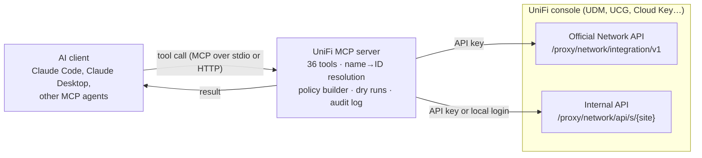

# UniFi MCP

[](https://github.com/SmugZombie/Unifi-MCP/actions/workflows/ci.yml)

**Run your UniFi network by asking.** UniFi MCP is a [Model Context Protocol](https://modelcontextprotocol.io) server that connects Claude and other AI agents to your UniFi console. Ask what's on your network, find a device you don't recognise, block it, or write a firewall rule, all in plain language. You approve every change.

📖 **Project site:** https://smugzombie.github.io/Unifi-MCP/

Built and tested against the **UniFi Network 10.6.106** API on UniFi OS 5.x, using the zone-based firewall.

> **You:** There's something called `ESP_3A1F2C` on the network. What is it, and can you keep it off the internet without kicking it off Wi-Fi?
>
> **Claude:** *(calls `unifi_list_clients`)* It's an Espressif chip, typical of smart plugs and sensors, on the IoT network. Here's a dry run of a policy that blocks just that device from the internet *(calls `unifi_create_firewall_policy` with `dryRun: true`)*. Shall I apply it?

## Why it matters

Home and small-office networks keep growing: dozens of phones, TVs, cameras and smart plugs, split across VLANs and guarded by firewall rules that few people want to edit by hand. The UniFi controller is powerful, but answering a simple question can mean five screens and a MAC address lookup.

- **Questions, not menus.** "Which devices are offline?" "What's on the guest network?" Get answers directly instead of clicking through dashboards.
- **Faster response.** When an unknown device appears, find it, identify the vendor and block it in one conversation.
- **Firewall rules you can read.** Zone-based policies are deeply nested JSON. The agent writes them from a plain description and shows a readable dry run before applying anything.
- **Local and private.** The server talks directly to your console on your LAN. No cloud account or third-party service is involved.
- **An open standard.** MCP works with Claude Code, Claude Desktop and a growing list of agents, so any MCP client can use your network as a tool.
- **You stay in control.** Every write needs your approval, every change is logged, and read-only mode removes write tools entirely.

## How it works



1. **You ask** a question or request a change. The AI client sees the tool list and their descriptions, and picks which tools to call.
2. **The agent gathers context**: it looks up clients by name to get MAC addresses, and lists zones and networks so names like "IoT" resolve to the right IDs.
3. **It proposes the change as a dry run.** The server builds the exact API request from simple fields (zones, MACs, ports, schedule) and returns a readable summary without sending anything.
4. **You approve, and the server applies it.** The result comes back in plain terms, and the change is appended to the audit log.

### Two UniFi APIs, one interface

| Capability | API used | Auth |
|---|---|---|
| Devices, networks, Wi-Fi, firewall zones and policies, ordering, device restart, PoE power-cycle | Official Network API (`/proxy/network/integration/v1`) | API key |
| Client search including offline clients, block, unblock, reconnect, rename | Internal API (`/proxy/network/api/s/<site>`) | API key, falling back to local admin login |
| Traffic flow logs, flow statistics, usage by app and client | Internal v2 API (`/proxy/network/v2/api/site/<site>`) | API key, falling back to local admin login |
| WAN usage reports | Internal API (`/stat/report/*`) | API key, falling back to local admin login |

The official API has no "block client" action and no flow logs, so those go through the internal APIs. Many consoles accept the API key there too. If yours doesn't, set `UNIFI_USERNAME`/`UNIFI_PASSWORD` and the server logs in with them automatically when the key is rejected.

The OpenAPI spec for 10.6.106 is in [`docs/`](docs/unifi-network-api-10.6.106.yaml).

## Setup

1. **Create an API key**: UniFi Network → Settings → Control Plane → Integrations → *Create API Key*.
2. **(Only if needed) Create a local admin** for blocking. Skip this if `npm run check` passes the internal-API step with just the key. Otherwise: UniFi OS → Admins & Users → add an admin with *Restrict to local access only*, Network role *Site Admin*. Don't use your Ubiquiti cloud account; MFA will break login.
3. Build and check the connection:

```sh
npm install
npm run build
cp .env.example .env   # fill it in
set -a; source .env; set +a
npm run check
```

`npm run check` checks reachability, TLS, the API key, the site, firewall zones and internal-API access, and tells you what's missing.

## Run with Docker Compose

In Compose the server runs as a long-lived HTTP service (MCP Streamable HTTP at `/mcp`). Clients connect by URL with a bearer token.

```sh
cp .env.example .env        # fill in UNIFI_* and set MCP_AUTH_TOKEN:
openssl rand -hex 32        # → paste as MCP_AUTH_TOKEN
docker compose up -d --build
docker compose run --rm unifi-mcp dist/check.js   # connection check
docker compose logs -f
```

- The port is published on `127.0.0.1:3000` only. Set `MCP_PUBLISH` in `.env` to change it: `127.0.0.1:3100` for another local port, or `3000` to listen on every interface so other machines on the LAN can connect. If you expose it, put it behind a TLS reverse proxy. The token is the only thing standing between the network and your firewall.
- The server won't start in HTTP mode without an `MCP_AUTH_TOKEN` of at least 24 characters. Requests carrying a browser `Origin` header are rejected unless listed in `MCP_ALLOWED_ORIGINS`.
- The audit log is kept in the `unifi-mcp-data` volume (`/data/audit.log`). View it with `docker compose exec unifi-mcp cat /data/audit.log`.
- The container runs as a non-root user with a read-only filesystem and no Linux capabilities, and has a health check on `/healthz`.
- To verify the console's TLS certificate, mount it (see the commented volume in `compose.yaml`) and set `UNIFI_CA_CERT=/certs/unifi.pem`.

Connect clients to it:

**Claude Code**

```sh
claude mcp add --transport http unifi http://localhost:3000/mcp \
  --header "Authorization: Bearer <MCP_AUTH_TOKEN>"
```

**Claude Desktop** (via the `mcp-remote` bridge)

```json
{
  "mcpServers": {
    "unifi": {
      "command": "npx",
      "args": ["-y", "mcp-remote", "http://localhost:3000/mcp", "--header", "Authorization:${AUTH}"],
      "env": { "AUTH": "Bearer <MCP_AUTH_TOKEN>" }
    }
  }
}
```

**Docker without a running service (stdio).** The client starts a throwaway container per session. No port or token is needed:

```json
{
  "mcpServers": {
    "unifi": {
      "command": "docker",
      "args": ["run", "--rm", "-i", "--env-file", "/Users/regli/Github/Unifi-MCP/.env", "-e", "MCP_TRANSPORT=stdio", "unifi-mcp:latest"]
    }
  }
}
```

## Run directly with Node

### Use it from Claude

**Claude Code** (stdio)

```sh
claude mcp add unifi \
  -e UNIFI_HOST=https://192.168.1.1 \
  -e UNIFI_API_KEY=xxxx \
  -e UNIFI_USERNAME=mcp-admin -e UNIFI_PASSWORD=xxxx \
  -e UNIFI_VERIFY_TLS=false \
  -- node /Users/regli/Github/Unifi-MCP/dist/index.js
```

**Claude Desktop** (stdio, `~/Library/Application Support/Claude/claude_desktop_config.json`)

```json
{
  "mcpServers": {
    "unifi": {
      "command": "node",
      "args": ["/Users/regli/Github/Unifi-MCP/dist/index.js"],
      "env": {
        "UNIFI_HOST": "https://192.168.1.1",
        "UNIFI_API_KEY": "xxxx",
        "UNIFI_USERNAME": "mcp-admin",
        "UNIFI_PASSWORD": "xxxx",
        "UNIFI_VERIFY_TLS": "false"
      }
    }
  }
}
```

## Run as a macOS login service

To keep the HTTP server running without a terminal or Claude session, install it as a LaunchAgent. It starts at login, restarts after a crash (at most every 30 seconds), and logs to `~/Library/Logs/unifi-mcp.log`. The template is in [`deploy/macos/`](deploy/macos/com.unifi-mcp.server.plist).

1. Build, and set the HTTP settings in `.env` (the agent sets `MCP_TRANSPORT=http` itself): `MCP_AUTH_TOKEN` (required), and optionally `MCP_HOST` / `MCP_PORT` (default `127.0.0.1:3000`; use `MCP_HOST=0.0.0.0` only if other machines on your LAN should connect).

   ```sh
   npm install && npm run build
   ```

2. Install the agent, filling in your paths:

   ```sh
   sed -e "s#__NODE__#$(command -v node)#" -e "s#__REPO__#$PWD#g" -e "s#__HOME__#$HOME#g" \
     deploy/macos/com.unifi-mcp.server.plist > ~/Library/LaunchAgents/com.unifi-mcp.server.plist
   plutil -lint ~/Library/LaunchAgents/com.unifi-mcp.server.plist
   launchctl bootstrap gui/$(id -u) ~/Library/LaunchAgents/com.unifi-mcp.server.plist
   ```

3. Check it, then connect Claude Code (use your `MCP_PORT`):

   ```sh
   curl -s http://127.0.0.1:3000/healthz
   tail ~/Library/Logs/unifi-mcp.log
   claude mcp add --transport http unifi http://127.0.0.1:3000/mcp \
     --header "Authorization: Bearer $(grep '^MCP_AUTH_TOKEN=' .env | cut -d= -f2)"
   ```

Managing it:

```sh
launchctl kickstart -k gui/$(id -u)/com.unifi-mcp.server   # restart, e.g. after npm run build
launchctl bootout gui/$(id -u)/com.unifi-mcp.server        # stop and unload
launchctl print gui/$(id -u)/com.unifi-mcp.server          # status, PID, last exit
```

Notes:

- With Homebrew, `command -v node` gives `/opt/homebrew/bin/node`, which keeps working across Node upgrades. A version-manager path (nvm, fnm) changes when you switch versions; re-run step 2 if it does.
- Run only one server per port. Stop any server started by hand before bootstrapping the agent.
- The agent reads `.env` at start-up; restart it after editing.
- If tool calls time out reaching the console, check System Settings → Privacy & Security → Local Network and allow `node`.

## Tools

**Read**
- `unifi_get_overview`: version, site, device states, client count, WANs
- `unifi_list_devices`, `unifi_get_device`: devices with live stats
- `unifi_list_clients`: connected, all, or blocked clients, with `search` by name, vendor, IP or MAC, current download/upload rates and totals, `sortBy: "traffic"`, and paging
- `unifi_get_client`: every field the controller has for one device
- `unifi_list_flows`, `unifi_get_flow`: traffic flow logs (Insights → Flows) filtered by time, device, action, direction, risk, IP, port, domain or country
- `unifi_traffic_by_app`: data usage by application and by device over hours to a month (top apps, top devices, what one device uses, who uses an app such as BitTorrent)
- `unifi_wan_usage`: internet download/upload totals, average Mbps and busiest interval, at 5-minute, hourly or daily granularity
- `unifi_lookup_dpi`: DPI application and category names by ID, or search by name
- `unifi_flow_top`: group flows server-side and return the top N by source IP, country, port, client, domain, service or policy, with an optional breakdown (`thenBy`)
- `unifi_list_port_forwards`: port-forward rules with target device names
- `unifi_wan_health`: WAN status, ISP, latency, drops, per-WAN availability and probes, last speed test, current throughput, gateway CPU/memory
- `unifi_list_scheduled_actions`: pending automatic undos from timed blocks
- `unifi_list_device_profiles`: device profiles, the watcher's interval and last run, and the changes it made recently
- `unifi_flow_statistics`: top clients, destinations, apps and blocking policies, and blocked/allowed counts by country and risk, per hour, day, week or month
- `unifi_list_networks`, `unifi_list_wifi`
- `unifi_list_firewall_zones`, `unifi_list_firewall_policies`, `unifi_get_firewall_policy`, `unifi_get_firewall_policy_order`
- `unifi_check_reachability`: answer "can X reach Y?" for devices, IPs, networks, domains or the internet, by walking the zone pair's policies in order with schedules (including overnight windows), return-traffic rules, blocked clients, same-network traffic and Wi-Fi client isolation; reports the deciding policy, exceptions, and when scheduled rules would apply
- `unifi_api_get`: read-only access to any other endpoint on the official, classic internal (`internal`) or newer internal (`internal-v2`) API, with paging, `fields` selection and `match` filtering for large lists. Paths with `.` or `..` segments are refused. A `body` turns it into a POST, allowed only for read-only query endpoints (`/stat/report/*`, `/traffic-flows`).

**Write** (not registered when `UNIFI_READ_ONLY=true`)
- `unifi_block_client` (optionally timed: `durationMinutes`, `untilTime: "06:00"` in the console's timezone, or `until`), `unifi_unblock_client`, `unifi_reconnect_client`, `unifi_rename_client`
- `unifi_block_internet`: cut internet access for devices while they stay on the LAN, optionally until a time; creates a temporary BLOCK policy per zone and removes it at expiry
- `unifi_cancel_scheduled_action`: lift a timed block early, or keep it indefinitely
- `unifi_set_device_profile`, `unifi_delete_device_profile`, `unifi_run_device_profiles`: keep a device, recognised by hostname, on a chosen Wi-Fi network and speed-limit group even when it rejoins under a new randomized MAC (see [Device profiles](#device-profiles))
- `unifi_create_firewall_policy`, `unifi_update_firewall_policy`, `unifi_set_firewall_policy_enabled`, `unifi_delete_firewall_policy`, `unifi_move_firewall_policy`
- `unifi_restart_device`, `unifi_power_cycle_port`

Firewall tools accept **zone and network names** ("IoT", "External") as well as IDs. Common rules can be described with simple fields: IPs/CIDRs/ranges, networks, MACs, domains, countries, ports and protocol. For anything else (apps, schedules, traffic-matching lists), pass `rawPolicy` in the API's own schema. `dryRun: true` shows the exact request without sending it.

### Example prompts

- "What's on my network right now that I don't recognise?"
- "Which devices are using the most bandwidth right now?"
- "What has the living-room TV been connecting to in the last hour?"
- "What got blocked overnight, and by which policies?"
- "Which device is using BitTorrent, and how much did it download this month?"
- "What's our average internet bandwidth this week, and when was the busiest hour?"
- "Which countries and ports is blocked inbound traffic coming from today?"
- "Turn off internet for the kids' iPads until 6 AM."
- "Keep the PC called DESKTOP-KIDPC on the Kids network at the Kids speed limit, even if it changes its MAC address."
- "Can the guest network reach my NAS? And can my kid's phone reach the internet right now?"
- "Block the device called *ESP_3A1F2C* and note it as unknown."
- "Create a firewall policy so the IoT zone can't reach Internal, except my Home Assistant at 10.0.0.20 on port 8123. Show me a dry run first."
- "Block inbound traffic from CN and RU to my port-forwarded services."
- "Disable the 'Kids bedtime' policy."

### Device profiles

A device that rejoins Wi-Fi under a new randomized MAC address looks like a brand-new client, so it lands on the SSID's default network without its speed limit. A device profile recognises it by hostname instead and puts it back:

- `unifi_set_device_profile` saves a profile: one or more hostnames, a network to force the device onto (the controller's Wi-Fi network override) and/or a speed-limit group. `dryRun: true` previews which connected clients would change.
- A watcher in the server checks connected clients every 5 minutes (`UNIFI_WATCH_INTERVAL_MS`). For a matching client that lacks the settings it updates the client record, names it after the profile if it has no name, and disconnects it once so it rejoins on the right network. Clients that already comply are left alone.
- `unifi_run_device_profiles` runs the check immediately; `unifi_list_device_profiles` shows the profiles, the last run and recent changes. Every change is written to the audit log as `profile_applied`.

Profiles are stored in `UNIFI_PROFILES_FILE` (default `profiles.json` next to the scheduled-actions file). The watcher does not run when `UNIFI_READ_ONLY=true`. Limits: matching is by hostname, so renaming the device defeats it; the network override applies to Wi-Fi clients only (wired clients get the speed group); and a new MAC is unrestricted until the next check.

## Safety

- Every change is appended to `~/.unifi-mcp/audit.log` (JSONL). Deleted policies are logged in full and can be restored with `rawPolicy`.
- System-defined policies are refused for update and delete.
- Write tools carry MCP `destructiveHint` annotations, so clients ask for approval.
- `UNIFI_READ_ONLY=true` leaves out every write tool.
- Timed blocks are undone by this server: pending undos are saved in `UNIFI_STATE_FILE` (default `~/.unifi-mcp/scheduled.json`, `/data/scheduled.json` in Docker) and survive restarts. If the server is not running at the expiry time, the undo runs as soon as it starts again. `unifi_list_scheduled_actions` shows what is pending.
- Policy order matters (first match wins per zone pair). Use `position: "top"` when a new BLOCK must beat an existing ALLOW.

## Troubleshooting

**The Docker container can't reach the console, but my computer can.** A Docker network probably overlaps your LAN. Once Docker runs out of `172.x` ranges it hands out `192.168.x.0/20` networks, and one of them can cover your console's address (for example `192.168.0.0/20` contains `192.168.1.1`). List the subnets:

```sh
for n in $(docker network ls -q); do
  docker network inspect -f '{{.Name}} {{range .IPAM.Config}}{{.Subnet}} {{end}}' $n
done
```

Fix it by setting `default-address-pools` in Docker's daemon settings to a range clear of your LAN and recreating the overlapping network, or run the server with Node instead.

**TLS errors.** Consoles use a self-signed certificate. Set `UNIFI_CA_CERT` to the exported certificate, or `UNIFI_VERIFY_TLS=false` on a trusted network.

**Blocking fails with "rejected (HTTP 401/403)".** Your console doesn't accept the API key on the internal API. Add a local-only admin as `UNIFI_USERNAME`/`UNIFI_PASSWORD`.

**A new block rule has no effect.** Policies are evaluated per source→destination zone pair, and the first match wins. Create it with `position: "top"` or move it with `unifi_move_firewall_policy`.

**Write tools are missing.** `UNIFI_READ_ONLY=true` removes them. Set it to `false` and restart the server.

**Block a client or write a firewall policy?** Blocking removes the device from the whole network. A firewall policy matching its MAC restricts only some traffic (for example internet access at night) while it stays connected.

## Configuration reference

All settings are environment variables; see [`.env.example`](.env.example). `MCP_TRANSPORT` is `stdio` (default when run with Node) or `http` (default in the Docker image), with `MCP_HOST`, `MCP_PORT`, `MCP_AUTH_TOKEN` and `MCP_ALLOWED_ORIGINS` applying to HTTP.

## Development

```sh
npm run dev        # run from source with tsx
npm test           # builder unit tests + end-to-end tests (stdio and HTTP) against a fake console
```

The project site is a single static page in [`site/`](site/index.html), deployed to GitHub Pages by [`.github/workflows/pages.yml`](.github/workflows/pages.yml) whenever `site/` changes on `main`. Preview it locally with:

```sh
open site/index.html
```

---

An independent project, not affiliated with or endorsed by Ubiquiti Inc. UniFi is a trademark of Ubiquiti Inc.
